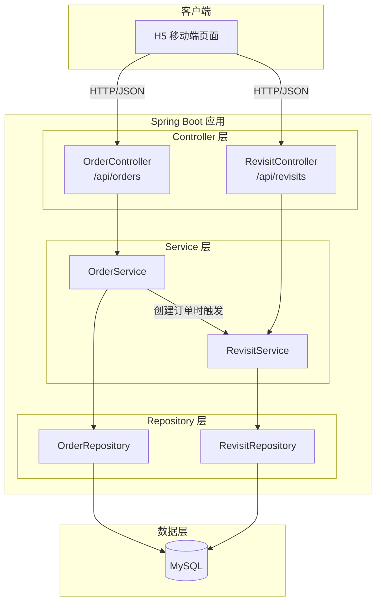
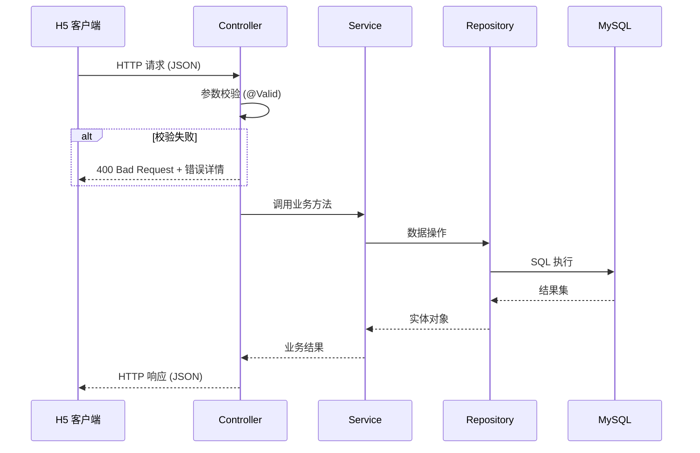
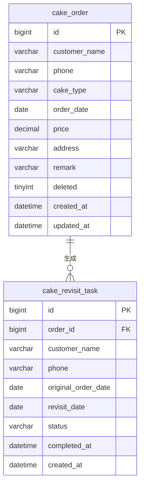

# 技术设计文档 - 蛋糕OA系统

## 概述

蛋糕OA系统是在现有 Spring Boot 2.6.13 项目（`com.example.cake`）基础上新增的功能模块，提供订单管理、周年回访提醒和移动端 H5 页面三大核心能力。系统采用经典的三层架构（Controller → Service → Repository），使用 MySQL 作为持久化存储，通过 RESTful API 对外提供服务，前端使用纯 HTML/CSS/JavaScript 构建响应式 H5 页面。

核心设计决策：
- 客户信息直接嵌入订单记录，不单独建客户表，简化数据模型
- 订单采用逻辑删除，保留历史数据完整性
- 回访任务在订单创建时同步生成，通过定时任务无关，仅依赖查询时的日期过滤展示当日待处理任务
- H5 页面作为静态资源部署在 Spring Boot 的 `static` 目录下，无需额外前端构建工具

## 架构

### 整体架构



### 技术栈

| 层级 | 技术选型 | 说明 |
|------|---------|------|
| Web 框架 | Spring Boot 2.6.13 | 现有项目基础 |
| 持久层 | Spring Data JPA + Hibernate | ORM 映射，简化数据库操作 |
| 数据库 | MySQL | 已在 pom.xml 中引入 mysql-connector-j |
| 数据校验 | Hibernate Validator (JSR 380) | 请求参数校验 |
| 前端 | HTML + CSS + Vanilla JS | 轻量级 H5 页面，无框架依赖 |
| 测试 | JUnit 5 + jqwik | 单元测试 + 属性测试 |

### 请求处理流程



## 组件与接口

### 1. OrderController

REST 控制器，处理订单相关的 HTTP 请求。

```java
@RestController
@RequestMapping("/api/orders")
public class OrderController {
    POST   /              → 创建订单，返回 201
    GET    /              → 分页查询订单列表（支持 page, size, keyword 参数）
    GET    /{id}          → 查询订单详情
    PUT    /{id}          → 更新订单
    DELETE /{id}          → 逻辑删除订单，返回 204
}
```

### 2. RevisitController

REST 控制器，处理回访任务相关的 HTTP 请求。

```java
@RestController
@RequestMapping("/api/revisits")
public class RevisitController {
    GET    /              → 分页查询回访任务列表（支持 page, size, status 参数）
    GET    /{id}          → 查询回访任务详情（含关联订单信息）
    PUT    /{id}/complete → 标记回访任务为已完成
}
```

### 3. OrderService

订单业务逻辑层，负责订单 CRUD 和触发回访任务创建。

```java
public interface OrderService {
    Order createOrder(OrderCreateRequest request);      // 创建订单 + 触发回访任务生成
    Page<Order> listOrders(int page, int size, String keyword);  // 分页查询，keyword 匹配姓名或手机号
    Order getOrder(Long id);                            // 查询单个订单
    Order updateOrder(Long id, OrderUpdateRequest request);  // 更新订单
    void deleteOrder(Long id);                          // 逻辑删除
}
```

### 4. RevisitService

回访任务业务逻辑层。

```java
public interface RevisitService {
    void createRevisitTask(Order order);                // 根据订单生成回访任务
    Page<RevisitTask> listTasks(int page, int size, String status);  // 分页查询，按状态筛选
    RevisitTask getTask(Long id);                       // 查询回访任务详情
    RevisitTask completeTask(Long id);                  // 标记完成
}
```

### 5. Repository 层

```java
public interface OrderRepository extends JpaRepository<Order, Long> {
    Page<Order> findByDeletedFalseAndCustomerNameContainingOrDeletedFalseAndPhoneContaining(
        String name, String phone, Pageable pageable);
    Page<Order> findByDeletedFalse(Pageable pageable);
}

public interface RevisitRepository extends JpaRepository<RevisitTask, Long> {
    Page<RevisitTask> findByStatus(String status, Pageable pageable);
}
```

### 6. 统一响应与异常处理

```java
// 统一 API 响应包装
public class ApiResponse<T> {
    private int code;
    private String message;
    private T data;
}

// 全局异常处理
@RestControllerAdvice
public class GlobalExceptionHandler {
    // 处理 MethodArgumentNotValidException → 400
    // 处理 ResourceNotFoundException → 404
    // 处理其他异常 → 500
}
```

## 数据模型

### 订单表 (cake_order)

| 字段 | 类型 | 约束 | 说明 |
|------|------|------|------|
| id | BIGINT | PK, AUTO_INCREMENT | 订单主键 |
| customer_name | VARCHAR(50) | NOT NULL | 客户姓名 |
| phone | VARCHAR(20) | NOT NULL | 手机号 |
| cake_type | VARCHAR(100) | NOT NULL | 蛋糕类型 |
| order_date | DATE | NOT NULL | 订购日期 |
| price | DECIMAL(10,2) | NOT NULL | 价格 |
| address | VARCHAR(255) | NOT NULL | 收货地址 |
| remark | VARCHAR(500) | | 备注 |
| deleted | TINYINT(1) | DEFAULT 0 | 逻辑删除标记：0-正常，1-已删除 |
| created_at | DATETIME | NOT NULL | 创建时间 |
| updated_at | DATETIME | NOT NULL | 更新时间 |

### 回访任务表 (cake_revisit_task)

| 字段 | 类型 | 约束 | 说明 |
|------|------|------|------|
| id | BIGINT | PK, AUTO_INCREMENT | 回访任务主键 |
| order_id | BIGINT | FK → cake_order.id, NOT NULL | 关联订单 ID |
| customer_name | VARCHAR(50) | NOT NULL | 客户姓名（冗余存储，方便查询） |
| phone | VARCHAR(20) | NOT NULL | 手机号（冗余存储） |
| original_order_date | DATE | NOT NULL | 原订购日期 |
| revisit_date | DATE | NOT NULL | 回访日期（原订购日期 + 1年） |
| status | VARCHAR(20) | NOT NULL, DEFAULT 'PENDING' | 回访状态：PENDING / COMPLETED |
| completed_at | DATETIME | | 完成时间 |
| created_at | DATETIME | NOT NULL | 创建时间 |

### JPA 实体映射

```java
@Entity
@Table(name = "cake_order")
public class Order {
    @Id @GeneratedValue(strategy = GenerationType.IDENTITY)
    private Long id;
    private String customerName;
    private String phone;
    private String cakeType;
    private LocalDate orderDate;
    private BigDecimal price;
    private String address;
    private String remark;
    private Boolean deleted = false;
    private LocalDateTime createdAt;
    private LocalDateTime updatedAt;
}

@Entity
@Table(name = "cake_revisit_task")
public class RevisitTask {
    @Id @GeneratedValue(strategy = GenerationType.IDENTITY)
    private Long id;
    private Long orderId;
    private String customerName;
    private String phone;
    private LocalDate originalOrderDate;
    private LocalDate revisitDate;
    private String status = "PENDING";
    private LocalDateTime completedAt;
    private LocalDateTime createdAt;
}
```

### 回访日期计算逻辑

回访日期 = 订购日期 + 1 年。使用 `LocalDate.plusYears(1)` 计算。特殊情况：如果订购日期是 2 月 29 日（闰年），次年回访日期自动调整为 2 月 28 日（Java `LocalDate` 默认行为）。

### ER 关系图



## 正确性属性

*属性（Property）是指在系统所有合法执行中都应成立的特征或行为——本质上是对系统应做什么的形式化陈述。属性是人类可读规格说明与机器可验证正确性保证之间的桥梁。*

### 属性 1：订单创建与查询的往返一致性

*对于任意*合法的订单数据（包含客户姓名、手机号、蛋糕类型、订购日期、价格、收货地址、备注），创建订单后再通过 ID 查询该订单，返回的所有字段值应与创建时提交的数据一致。

**验证需求：1.1, 1.6**

### 属性 2：分页查询默认页大小不超过 10

*对于任意*数量的订单记录，当使用默认参数进行分页查询时，返回的当前页数据条数应不超过 10 条。

**验证需求：1.2**

### 属性 3：搜索结果过滤正确性

*对于任意*订单集合和任意搜索关键词，搜索返回的每一条订单的客户姓名或手机号中必须包含该关键词。

**验证需求：1.3**

### 属性 4：订单更新的往返一致性

*对于任意*已存在的订单和任意合法的更新数据，更新订单后再查询该订单，返回的字段值应与更新提交的数据一致。

**验证需求：1.4**

### 属性 5：逻辑删除后订单不出现在列表中

*对于任意*订单，执行逻辑删除后，该订单不应出现在正常的订单列表查询结果中，但通过数据库直接查询该记录仍然存在且 deleted 标记为 true。

**验证需求：1.5**

### 属性 6：同一手机号可创建多条订单

*对于任意*手机号和任意正整数 N，使用同一手机号连续创建 N 条订单，所有创建操作均应成功，且系统中该手机号对应的订单数量应等于 N。

**验证需求：1.7**

### 属性 7：回访任务自动生成与日期计算正确性

*对于任意*合法订单及其订购日期，创建订单后系统应自动生成一条回访任务，该回访任务的 revisitDate 应等于订购日期加一年，且任务中的客户姓名、手机号、原订购日期应与订单一致。

**验证需求：2.1, 2.2, 2.8**

### 属性 8：回访任务状态筛选正确性

*对于任意*回访任务集合，按状态（PENDING 或 COMPLETED）筛选查询时，返回的每一条回访任务的状态应与筛选条件一致。

**验证需求：2.3, 2.5**

### 属性 9：回访任务标记完成的状态变更

*对于任意*处于 PENDING 状态的回访任务，执行标记完成操作后，该任务的状态应变为 COMPLETED，且 completedAt 字段应为非空时间戳。

**验证需求：2.4**

### 属性 10：已删除订单不生成回访任务

*对于任意*已被逻辑删除的订单，系统不应为其生成新的回访任务。

**验证需求：2.7**

### 属性 11：JSON 序列化往返一致性

*对于任意*合法的订单对象或回访任务对象，将其序列化为 JSON 后再反序列化，得到的对象应与原始对象等价。

**验证需求：3.2**

### 属性 12：错误响应正确性

*对于任意*不合法的请求参数，API 应返回 HTTP 400 状态码且响应体包含错误字段和描述；*对于任意*不存在的资源 ID，API 应返回 HTTP 404 状态码且响应体包含未找到提示。

**验证需求：3.6, 3.7**

### 属性 13：分页响应结构完整性

*对于任意*分页查询请求（指定 page 和 size 参数），响应中应包含当前页数据列表、总记录数、总页数和当前页码，且总页数应等于 ceil(总记录数 / size)。

**验证需求：3.8, 3.9**

## 错误处理

### 全局异常处理策略

通过 `@RestControllerAdvice` 实现统一异常处理：

| 异常类型 | HTTP 状态码 | 处理方式 |
|---------|------------|---------|
| `MethodArgumentNotValidException` | 400 | 提取字段校验错误，返回字段名 + 错误描述列表 |
| `ResourceNotFoundException`（自定义） | 404 | 返回资源类型和 ID 的未找到提示 |
| `Exception`（兜底） | 500 | 记录日志，返回通用错误提示，不暴露内部细节 |

### 请求参数校验

使用 JSR 380 注解进行声明式校验：

```java
public class OrderCreateRequest {
    @NotBlank(message = "客户姓名不能为空")
    private String customerName;

    @NotBlank(message = "手机号不能为空")
    @Pattern(regexp = "^1[3-9]\\d{9}$", message = "手机号格式不正确")
    private String phone;

    @NotBlank(message = "蛋糕类型不能为空")
    private String cakeType;

    @NotNull(message = "订购日期不能为空")
    private LocalDate orderDate;

    @NotNull(message = "价格不能为空")
    @DecimalMin(value = "0.01", message = "价格必须大于0")
    private BigDecimal price;

    @NotBlank(message = "收货地址不能为空")
    private String address;

    private String remark;  // 可选字段
}
```

### 错误响应格式

```json
{
    "code": 400,
    "message": "请求参数校验失败",
    "data": {
        "errors": [
            { "field": "phone", "message": "手机号格式不正确" },
            { "field": "customerName", "message": "客户姓名不能为空" }
        ]
    }
}
```

## 测试策略

### 双重测试方法

本项目采用单元测试与属性测试相结合的方式，确保全面覆盖：

- **单元测试（JUnit 5）**：验证具体示例、边界情况和错误条件
- **属性测试（jqwik）**：验证跨所有输入的通用属性

两者互补：单元测试捕获具体 bug，属性测试验证通用正确性。

### 属性测试库

使用 [jqwik](https://jqwik.net/) 作为 Java 属性测试框架，需在 `pom.xml` 中添加依赖：

```xml
<dependency>
    <groupId>net.jqwik</groupId>
    <artifactId>jqwik</artifactId>
    <version>1.7.4</version>
    <scope>test</scope>
</dependency>
```

### 属性测试配置要求

- 每个属性测试最少运行 100 次迭代
- 每个属性测试必须通过注释引用设计文档中的属性编号
- 注释格式：`// Feature: cake-oa-system, Property {number}: {property_text}`
- 每个正确性属性由一个属性测试实现

### 单元测试范围

| 测试类别 | 测试内容 | 示例 |
|---------|---------|------|
| API 端点测试 | 验证 HTTP 方法映射和路径 | GET /api/orders 返回 200 |
| 成功状态码测试 | 验证各操作的正确状态码 | POST 返回 201，DELETE 返回 204 |
| 边界情况测试 | 闰年日期回访计算 | 2024-02-29 → 2025-02-28 |
| 集成测试 | 订单创建触发回访任务生成 | 创建订单后验证回访任务存在 |

### 属性测试范围

| 属性编号 | 测试描述 | 对应设计属性 |
|---------|---------|------------|
| P1 | 订单创建-查询往返一致性 | 属性 1 |
| P2 | 分页默认大小约束 | 属性 2 |
| P3 | 搜索过滤正确性 | 属性 3 |
| P4 | 订单更新往返一致性 | 属性 4 |
| P5 | 逻辑删除后列表不可见 | 属性 5 |
| P6 | 同手机号多订单 | 属性 6 |
| P7 | 回访任务自动生成与日期计算 | 属性 7 |
| P8 | 回访任务状态筛选 | 属性 8 |
| P9 | 回访任务标记完成 | 属性 9 |
| P10 | 已删除订单不生成回访 | 属性 10 |
| P11 | JSON 序列化往返 | 属性 11 |
| P12 | 错误响应正确性 | 属性 12 |
| P13 | 分页响应结构完整性 | 属性 13 |
